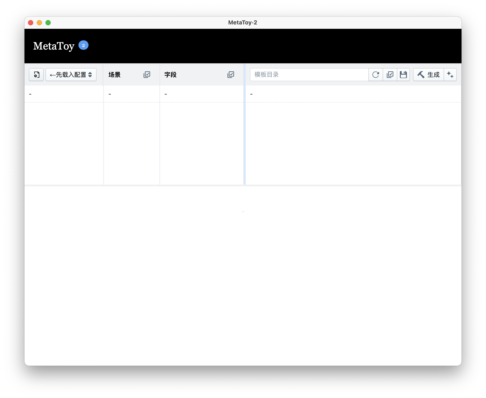
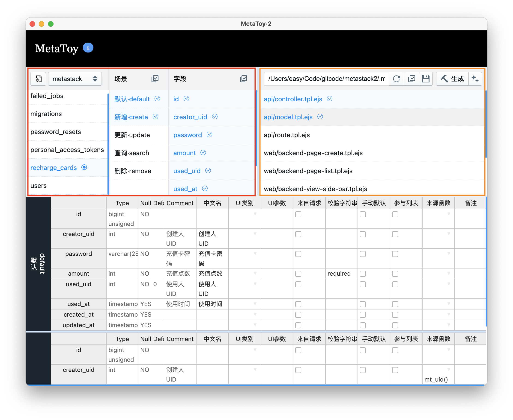

# MetaToy2
MetaToy 是一个通用代码生成工具。它包含两部分：

1. 命令行 MetaToy Cli, 采用GPLv3 开源
1. 图形界面  MetaToy UI, 不开源但可以免费使用

## 使用方式

通常来讲，MetaToy 作为项目级生成器使用，每个项目可在跟目录建立 .metatoy 目录，并在其中放置配置文件和对应的模板。本文将按此进行说明。

当然你也可以按其他方式使用，是要保证 metatoy.settings.jsonc 文件和其他目录的相对位置不变即可。

## 命令行 MetaToy Cli

运行 MetaToy Cli 需要 Node 环境(14+)

一个典型的命令如下：

```bash
node .metatoy/exec.mjs api controller --name=Book --cn_name=书籍
```

其中 `api controller` 部分对应 `.metatoy/_template` 下的 `api/controller.tpl.ejs` 文件。

如果想要生成 api 目录下的全部模板，那么可以 

```bash
node .metatoy/exec.mjs api --name=Book --cn_name=书籍
```

具体逻辑可以查看 `.metatoy/exec.mjs`

#### 模版

代码模板存放于 `.metatoy/_template` 下，可自行分目录存放，模板文件均需要以 `.tpl.ejs` 结尾。

模板采用`ejs`语法，可[访问官网查看](https://github.com/mde/ejs)

`.metatoy/_template` 目录中默认包含的是全栈引擎 MetaStack 的前后端模版，不需要的话可以直接删除。

##### 头标记

模板头部必须包含头标记，其格式如下：

```
/* @MT-TPL-FILE
 * @Desc: API接口
 * @To: api/app/Http/Controllers/<%=OPT.TheName%>Controller.php 
 * @Replace: -
 */
```

其中 To 参数指明了生成后的模板写入哪个文件；Replace 则指定了文件已经存在时的行为。如果设置为 `@Replace: overwrite` 会每次重新生成全文，并覆盖原有文件。

但这种模式下手工修改会丢失。所以当设置为 `@Replace: -` 时会开启智能覆盖模式。

##### 区块标记

智能覆盖模式不会直接覆盖整个文件，它会在模板中搜索区块标记，只覆盖目标文件中由同样标记包裹的部分内容。

以下代码就包含了由 `@MT-TPL-LIST-START` 和 `@MT-TPL-LIST-END` 构成的区块标记。
```php
public function search()
{
    /* @MT-TPL-LIST-START */
    $<%=OPT.the_name%>_array = <%=OPT.TheName%>::all();
    /* @MT-TPL-LIST-END */

    return http_result( ['<%=OPT.the_name%>_array'=>$<%=OPT.the_name%>_array] );
    
}
```

在第一次生成时，以上模板代码会被编译为：

```php
public function search()
{
    /* @MT-TPL-LIST-START */
    $recharge_cards_array = RechargeCards::all();
    /* @MT-TPL-LIST-END */

    return http_result( ['recharge_cards_array'=>$recharge_cards_array] );

}

```

这个时候如果我们想对返回值进行加工，可以在生成好的代码中的区块标记后手工添加代码：

```php
public function search()
{
    /* @MT-TPL-LIST-START */
    $recharge_cards_array = RechargeCards::all();
    /* @MT-TPL-LIST-END */

    // 这里是手工修改
    if( $recharge_cards_array['creator_uid'] != auth()->id() )
    return send_error( "只能查询自己的充值卡", "AUTH" );

    return http_result( ['recharge_cards_array'=>$recharge_cards_array] );

}
```

第二次生成时，MetaToy 只会替换区块标签包裹部分的内容，手工修改得以保留。

##### 区块标记的高级用法

###### 追加模式

默认情况下，区块标记会用新生成的内容替换原有内容。但在一些场景，比如路由、列表中，我们想要的不是替换，而是追加。这个时候可以设置区块的 Replace 模式为 append。

以下是一个实际例子：
```php
/* @MT-TPL-ROUTE-LIST-START */
/* @Replace: append */
/* @SkipIf: Route::post('/<%=OPT.the_name%> */

<%_ for( action of ['save','update','remove','search'] ){_%>
Route::post('/<%=OPT.the_name%>/<%=H.low(action)%>', 'App\Http\Controllers\<%=OPT.TheName%>Controller@<%=H.lc(action)%>');    
<%_}_%>

/* @MT-TPL-ROUTE-LIST-END */
```

###### Skip

追加模式必然会遇到一个问题，就是重复执行生成命令的时候，会出现重复追加。为了避免这个问题，我们又引入了 `SkipIf` 和 `SkipRegex` 两个设置。

当之前生成的代码中包含字符串或者匹配正则时，会自动跳过追加过程。这就解决重复追加的问题。

###### Wrap

由于我们采用类似 `/* @MT-TPL-NAV-START */` 的注释来实现区块标记，在React中，直接使用注释会作为内容直接输出，因此我们需要用 `{}` 将其包裹起来。

```jsx
{/* @MT-TPL-NAV-START */
/* @Replace: append */
/* @Wrap: react */
/* @SkipIf: to="/<%=OPT.the_name%>/list" */

<NavLink to="/<%=OPT.the_name%>/list" className="nav-link p-3 block hover:bg-blue-100 flex flex-row items-center"><FaRegDotCircle size={20}  className="m-2"/><%=H.as(OPT.TheName)%></NavLink>

/* @MT-TPL-NAV-END */}
```

当有多个内容时就会生成如下代码：

```jsx
{/* @MT-TPL-NAV-START */
    
    <NavLink to="/recharge_cards/list" className="nav-link p-3 block hover:bg-blue-100 flex flex-row items-center"><FiCreditCard size={20}  className="m-2"/>Recharge Cards</NavLink>

    <NavLink to="/user/api/token" className="nav-link p-3 block hover:bg-blue-100 flex flex-row items-center"><FiKey size={20}  className="m-2"/>API Token</NavLink>

/* @MT-TPL-NAV-END */}
```
在 HTML 中这很正常，但是在 React 中，一个组件的根对象不能有两个，因此我们只能进行包裹，这样才不会报错：

```jsx
{/* @MT-TPL-NAV-START */
    
    <>
    <NavLink to="/recharge_cards/list" className="nav-link p-3 block hover:bg-blue-100 flex flex-row items-center"><FiCreditCard size={20}  className="m-2"/>Recharge Cards</NavLink>

    <NavLink to="/user/api/token" className="nav-link p-3 block hover:bg-blue-100 flex flex-row items-center"><FiKey size={20}  className="m-2"/>API Token</NavLink>
    </>

/* @MT-TPL-NAV-END */}
```
开启 `@Wrap: react` 参数，可以让 MetaToy 帮你自动包裹。

```jsx
{/* @MT-TPL-NAV-START */
/* @Replace: append */

/* @Wrap: react */ <-- 这里

/* @SkipIf: to="/<%=OPT.the_name%>/list" */

<NavLink to="/<%=OPT.the_name%>/list" className="nav-link p-3 hover:bg-blue-100 flex flex-row items-center"><FaRegDotCircle size={20}  className="m-2"/><%=H.as(OPT.TheName)%></NavLink>

/* @MT-TPL-NAV-END */}
```


#### 字段数据

在模板中我们需要知道数据库字段在各个场景下的形态，比如是否参与验证、验证的rule。这些信息被放置一个JSONC文件（JSON格式，可写入注释）中 `.metatoy/metatoy.data.jsonc`。其基本格式为：

```
{
    "project": "metastack",
    "version": "1.0",
    "tables": {
        "article": {
            "description": "文章表",
            "order": 1,
            "scenarios": {
                "default": {
                    "description": "默认场景",
                    "order": 1,
                    "fields": {
                        "title": {
                            "cn_name": "标题",
                            "type": "string",
                            "validate": "required|string",
                            "ui": "text-line",
                            "ui_options": {
                                "placeholder": "请输入标题"
                            }
                        },
                        ...
```

#### 帮助函数

在模板中，我们需要对这些数据进行查询、循环和显示。这些代码有大量的重复，因此我们将其封装到 Helper 中，可以在 `helper.mjs`中进行修改和添加。

fields 可能是模板中最常用的函数，它根据表名和场景获取字段数据。其定义如下：

```js
fields( meta, table, scenario=null, array=true )
{
        return this.section( meta, table, scenario, 'ALL', array );
}
```

在模板中我们通过`H.fields`来使用它：

```js

<%_ for( const field of H.fields(DATA,OPT.the_name,'create')??[])
{ if( field.source_func ){_%>
$validated['<%=field.name%>'] = <%=field.source_func%>;
<%_ }} _%>

```

其中 DATA 为字段和环境数据，DATA.DB 为  `.metatoy/metatoy.data.jsonc` 对应的 JSON 对象。

OPT则是命令行传入的参数，典型的是 `--name` 和 `--cn_name`。为了方便使用，我们还对name进行了自动大小写处理：

```
options.theName = helper.lc(options.name); // 小驼峰
options.TheName = helper.bc(options.name); // 大驼峰
options.the_name = helper.ul(options.name); // 小写+下划线分隔
```

可以通过 `OPT.the_name`等方式直接在模板中使用。


#### 将数据绑定到字段

手工编写 `.metatoy/metatoy.data.jsonc` 非常麻烦。尤其是进行字段修改后要同步维护它，这会导致我们有多份信息源，不符合元编程的精神。

我们可以直接从数据库中读取字段信息，但这部分信息并不包含关于界面、验证和其他。

一个好消息是，MySQL等数据库都提供了字段注释，我们可以把额外信息存放到里边。
一个坏消息是，这个注释最长只支持255，这让我们很难存放大量信息（比如格式过滤函数代码）。

Metatoy给出的解决方案是只在注释中存放一个唯一ID，而将ID对应的信息存放到一个Key-Value形式的文件中，这个唯一ID被称为MTID，而这个文件就是 `.metatoy/metatoy.kv.json`。

如果你使用 MetaStack ，那么这个ID可以以 `@MTID=xxx-xxx-xxx`的方式手工添加进去，也可以使用我们提供的 Laravel 命令： 

```php
php artisan metatoy:mtid {table}
```

这个命令会监测数据表的注释，并生成一个 Migration，用于给所有不包含 @MTID 的字段自动添加MTID。

你可以运行以下命令执行它。

```php
php artisan migrate
```

#### 图形界面

由于数据分处两地，这让我们使用起来非常不直观，因此我们开发了一个图形界面 MetaToyUI 来提升使用体验。该程序可以从仓库的 `release` 处获取。

要使用 MetaToyUI，首先你需要在配置文件`.metatoy/metatoy.settings.jsonc`中设置一些基本信息：

```jsonc
{
    // 数据库连接信息
    "mysql":{
        "host":"localhost",
        "port":3306,
        "user":"root",
        "password":"",
        "database":"metastack"
    },
    // 场景列表
    "scenarios":[
        {"id":"default","name":"默认"}
        // ...
    ],
    // 扩展字段和对应类型和数据
    // type 支持 checkbox 
    "extra_fields":[
        {"id":"cn_name","name":"中文名","values":null},
        // ...
    ]
}
```

你可以参考现有文件进行修改。注意默认场景（default）是一个特殊场景，其他场景如果字段值为空，那么会从默认场景读取。

然后启动 MetaToyUI，点击左侧 Logo 下的文件图标，载入刚才编辑的文件。注意MetaToyUI 会根据它来计算其他依赖文件的路径。

  


成功连接数据库后，MetaToyUI 会载入数据库字段以供选择和设置。

  

右侧黄色框选区域会列出 `.metatoy/_template` 目录下所有模板，可以选中多个以后点击「生成」按钮。

生成提示结果会在按钮上方显示，如果觉得显示区域不够大，可以用快捷键 Cmd+Alt+I 调出 Devtools 查看日志。

> 特别提醒：MetaToyUI 并不能独立工作，它依赖 MetaToyCli，因此需要确保命令行环境可用。以及数据库字段必须有 MTID，否则在界面设置的信息将无法成功保存。